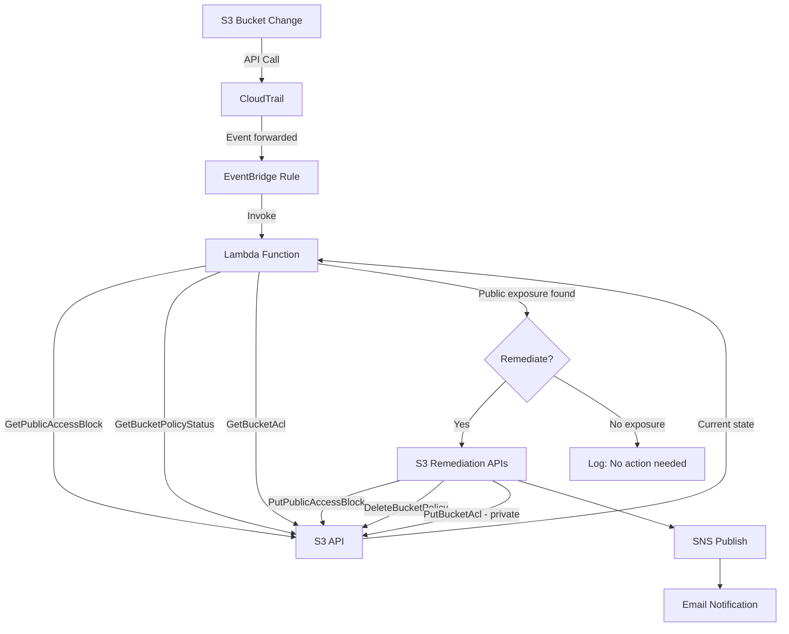

# Event-Driven S3 Public Access Corrective Control

**Level:** Intermediate
**Platform:** DevSecBlueprint
**Estimated time:** 60–90 minutes

---

## 1. Introduction

### Why Public S3 Access Is a Security Risk

S3 buckets are one of the most common sources of cloud data breaches - not because S3 is insecure by design, but because a single misconfiguration can expose terabytes of data to the public internet with no authentication required.

The risks are concrete:

- **Data exposure**: A misconfigured bucket can make sensitive files — customer records, financial data, internal documents — readable by anyone with the URL.
- **Compliance violations**: GDPR, HIPAA, and PCI-DSS all require strict controls over who can access sensitive data. A public bucket is an automatic violation. Fines and audit findings follow.
- **Breach vectors**: Attackers actively scan for public S3 buckets. Credential leaks (e.g., access keys committed to GitHub) combined with a public bucket create a direct path to data exfiltration. Even without credentials, a public bucket is already exfiltrated.

The problem isn't just that buckets get misconfigured — it's that misconfiguration can happen in seconds and go undetected for hours or days without the right controls in place.

### Preventative vs Detective vs Corrective Controls

Security controls fall into three categories, and understanding the difference is essential for building a layered defence:

**Preventative controls** stop a misconfiguration from happening in the first place. Examples include an AWS Service Control Policy (SCP) that denies `s3:PutBucketPublicAccessBlock` when set to a permissive (false) value, enforcing account-level S3 Block Public Access settings to ensure public access is disabled across all buckets by default, or a Terraform policy-as-code check that blocks a plan if a bucket is configured as public. These measures act as your first line of defense.

**Detective controls** identify when something has gone wrong. Examples: AWS Config rules that flag public buckets, GuardDuty findings, or CloudTrail log analysis. Detective controls tell you something happened - but they don't fix it.

**Corrective controls** respond to a detected issue and restore the desired state. **This is what you're building here:** a control that detects a public access configuration change and automatically remediates it - re-enabling Block Public Access, removing public-access statements from bucket policies, and resetting public ACLs - then notifies your team.

### How Real-Time Event-Driven Corrective Controls Work

The architecture follows a simple principle: **an event triggers evaluation, and evaluation drives action**.

When an S3 API call is made (e.g., `PutBucketAcl`), CloudTrail logs it. EventBridge picks up the event and invokes a Lambda function. Lambda then queries the bucket's *current live state* - not the event payload - to determine whether public exposure actually exists. If it does, Lambda remediates. If it doesn't, Lambda logs "no action needed" and exits.

This is a critical design choice: **never make remediation decisions based solely on the event name or payload**. The event tells you something changed. The live state tells you whether that change created a problem. Always check the live state before acting.

---

## 2. Prerequisites

Before you start, make sure you have the following in place.

### Required Tools

| Tool | Version | Verify |
|---|---|---|
| AWS CLI | Any recent version (v2 recommended) | `aws --version` |
| Terraform | >= 1.0 | `terraform version` |
| Python | 3.13 | `python3 --version` |

```bash
aws --version
# Expected: aws-cli/2.x.x ...

terraform version
# Expected: Terraform v1.x.x

python3 --version
# Expected: Python 3.13.x
```

### AWS Account

You need an AWS sandbox account with permissions to create and manage:

- S3 buckets and bucket policies
- CloudTrail trails
- EventBridge rules
- Lambda functions
- IAM roles and policies
- SNS topics and subscriptions

> **Warning: Use a sandbox account only.** This control automatically modifies bucket policies and resets ACLs. Do not deploy it in a production account without testing in sandbox - it will remediate any bucket that triggers the EventBridge rule, which can disrupt live workloads.

Verify your AWS CLI is configured and pointing at the right account:

```bash
aws sts get-caller-identity
```

### SNS Email Subscription

After deploying with Terraform, AWS will send a confirmation email to the address you configure in `notification_email`. **You must click the confirmation link before any SNS alerts will be delivered.** Unconfirmed subscriptions silently drop messages.

---

## 3. Architecture Overview

### End-to-End Flow



### Service Roles

**CloudTrail** captures every S3 management API call in the region and forwards events to EventBridge. Without CloudTrail enabled, EventBridge has no visibility into S3 API activity. A dedicated trail and S3 bucket are deployed by Terraform to store the logs.

**EventBridge** acts as the event router. A rule filters CloudTrail events for four specific S3 API calls — `PutBucketPolicy`, `PutBucketAcl`, `PutBucketPublicAccessBlock`, and `DeletePublicAccessBlock` — and invokes the Lambda function when any of them fires.

**Lambda** is where the logic lives. It receives the EventBridge event, extracts the bucket name and actor identity, queries the bucket's current state via three independent S3 API calls, and decides whether to remediate. If findings exist, it applies targeted remediation and publishes an SNS notification.

**S3 API** is called twice: first for evaluation (read-only: `GetPublicAccessBlock`, `GetBucketPolicyStatus`, `GetBucketAcl`), then for remediation (write: `PutBucketPublicAccessBlock`, `GetBucketPolicy`/`PutBucketPolicy`, `PutBucketAcl`).

**SNS** delivers the remediation alert to your email. The topic and subscription are deployed by Terraform. The subscription must be confirmed before alerts are delivered.

**IAM** grants Lambda the minimum least privilege permissions it needs — specific S3 read and write actions, SNS publish scoped to the specific topic, and CloudWatch Logs for execution logging.

---

## 4. Deploy the Control with Terraform

### Set Your Variables

Before deploying, open `variables.tf` and set your notification email:

```hcl
variable "notification_email" {
  description = "Email address for SNS notifications"
  type        = string
  default     = "your-email@example.com"  # Replace this
}
```

Or override at apply time:

```bash
terraform apply -var="notification_email=you@example.com"
```

### Deploy

```bash
terraform init
terraform apply
```

`terraform init` downloads the pinned providers: `hashicorp/aws ~> 5.0` and `hashicorp/random ~> 3.0`. Provider versions are pinned in `.terraform.lock.hcl`.

Before running `terraform apply`, build the Lambda deployment package manually:

Zip lambda function with dependencies 
```bash
python3 -m venv venv && source venv/bin/activate && pip install -r requirements.txt && deactivate
cd venv/lib/python*/site-packages && zip -r ../../../../lambda_function.zip . && cd - >/dev/null
zip -g lambda_function.zip lambda_function.py && rm -rf venv
```

Review the plan output, then type `yes` to confirm. Terraform deploys the following resources:

| Resource | Purpose |
|---|---|
| `aws_cloudtrail.s3_trail` | Captures S3 API calls and forwards to EventBridge |
| `aws_s3_bucket.trail_bucket` | Stores CloudTrail log files |
| `aws_s3_bucket_lifecycle_configuration.trail_bucket_lifecycle` | CloudTrail Bucket Lifecycle 3 days |
| `aws_s3_bucket_policy.trail_bucket_policy` | Restricts trail bucket writes to the CloudTrail service principal |
| `aws_cloudwatch_log_group.lambda_logs` | CloudWatch Log Group for Lambda with 7-day retention |
| `aws_cloudwatch_event_rule.s3_events_rule` | EventBridge rule filtering the four S3 API events |
| `aws_cloudwatch_event_target.lambda_target` | Wires the EventBridge rule to the Lambda function |
| `aws_lambda_function.s3_public_access_remediator` | The evaluation and remediation function |
| `aws_iam_role.lambda_role` | Lambda execution role |
| `aws_iam_policy.lambda_policy` | Least-privilege policy attached to the role |
| `aws_sns_topic.s3_public_remediate_alerts` | SNS topic for remediation alerts |
| `aws_sns_topic_subscription.email_subscription` | Email subscription to the SNS topic |

### Terraform Outputs

After a successful apply, Terraform prints:

```
Outputs:

cloudtrail_name           = "s3-public-access-trail"
cloudwatch_log_group_name = "/aws/lambda/s3-public-access-remediator"
lambda_function_arn       = "arn:aws:lambda:us-east-1:123456789012:function:s3_public_access_remediator"
sns_topic_arn             = "arn:aws:sns:us-east-1:123456789012:s3_public_remediate_alerts"
```

Retrieve at any time with `terraform output`.

> **After `terraform apply` completes**, check your inbox for the SNS subscription confirmation email and click the link. The control is deployed but alerts won't be delivered until the subscription is confirmed.

---

## 5. Configure IAM Permissions for EventBridge, Lambda, and SNS

Three services interact in this control, and each has specific IAM requirements.

### EventBridge → Lambda

EventBridge needs permission to invoke the Lambda function. This is granted via a Lambda resource-based policy (not an IAM role), deployed by Terraform as `aws_lambda_permission.allow_eventbridge`:

```hcl
resource "aws_lambda_permission" "allow_eventbridge" {
  statement_id  = "AllowExecutionFromEventBridge"
  action        = "lambda:InvokeFunction"
  function_name = aws_lambda_function.s3_public_access_remediator.function_name
  principal     = "events.amazonaws.com"
  source_arn    = aws_cloudwatch_event_rule.s3_events_rule.arn
}
```

The `source_arn` constraint scopes the permission to this specific EventBridge rule only.

### Lambda Execution Role

The Lambda function assumes an IAM role (`s3-public-alert-lambda-role`) with a least-privilege policy:

```json
{
  "Version": "2012-10-17",
  "Statement": [
        {
            "Action": [
                "s3:GetBucketAcl",
                "s3:GetBucketPolicy",
                "s3:GetBucketPolicyStatus",
                "s3:GetBucketPublicAccessBlock"
            ],
            "Effect": "Allow",
            "Resource": "*",
            "Sid": "AllowS3ReadOnly"
        },
        {
            "Action": [
                "s3:PutBucketPublicAccessBlock",
                "s3:PutBucketPolicy",
                "s3:PutBucketAcl",
                "s3:DeleteBucketPolicy"
            ],
            "Effect": "Allow",
            "Resource": "*",
            "Sid": "AllowS3WriteAccess"
        },        
        {
          "Effect": "Allow",
          "Action": ["sns:Publish"],
          "Resource": "<sns-topic-arn>"
        },
        {
          "Effect": "Allow",
          "Action": [
            "logs:CreateLogGroup",
            "logs:CreateLogStream",
            "logs:PutLogEvents"
          ],
          "Resource": "*"
        }
  ]
}
```

### Why Each Permission Is Needed

**Read actions (evaluation phase):**
- `s3:GetBucketPublicAccessBlock` — check whether Block Public Access is fully enabled
- `s3:GetBucketPolicyStatus` — check whether the bucket policy grants public access
- `s3:GetBucketAcl` — check whether the ACL grants access to public groups

**Write actions (remediation phase):**
- `s3:PutBucketPublicAccessBlock` — re-enable all four Block Public Access settings
- `s3:GetBucketPolicy` — fetch the full policy JSON before modifying it
- `s3:PutBucketPolicy` — write back the sanitised policy (public statements removed)
- `s3:DeleteBucketPolicy` — fallback when all statements were public and none remain
- `s3:PutBucketAcl` — reset the bucket ACL to `private`

**Notification:**
- `sns:Publish` — scoped to the specific SNS topic ARN, not all topics

**Logging:**
- `logs:CreateLogGroup`, `logs:CreateLogStream`, `logs:PutLogEvents` — write execution logs to CloudWatch

### SNS Topic Policy

No custom resource policy is needed. Lambda publishes using its IAM role's `sns:Publish` permission. The topic is private by default.

### Least Privilege

No wildcard actions like `s3:*` are used. The `sns:Publish` action is scoped to the exact topic ARN.

---

## 6. Review the Lambda Remediation Logic

The Lambda function is structured into focused, single-responsibility functions. Here's a walkthrough of each.

### Data Models

Two dataclasses carry state through the function:

```python
@dataclass
class BucketContext:
    bucket_name: str      # Name of the affected S3 bucket
    account_id: str       # AWS account ID
    region: str           # AWS region
    actor: str            # Full IAM ARN of the actor who made the change
    actor_name: str       # Human-readable name extracted from the ARN
    event_name: str       # Triggering API call (e.g. "PutBucketAcl")
    event_time: str       # ISO 8601 timestamp from CloudTrail
    readable_time: str    # Formatted: "YYYY-MM-DD HH:MM:SS UTC"


@dataclass
class Finding:
    check_type: str    # "PUBLIC_ACCESS_BLOCK" | "BUCKET_POLICY" | "BUCKET_ACL"
    description: str   # Human-readable description of the exposure
    remediated: bool = False
```

`BucketContext` is populated from the EventBridge event detail. `Finding` objects are created by `evaluate_bucket()` and updated by `remediate_bucket()`.

### evaluate_bucket()

Queries the bucket's live state and returns a list of findings. All three checks run independently — a failure in one does not prevent the others from running.

```python
def evaluate_bucket(bucket_name: str) -> list:
    findings = []

    # Check 1: Public Access Block — all four settings must be True
    try:
        pab = s3.get_public_access_block(Bucket=bucket_name)
        if not all(pab["PublicAccessBlockConfiguration"].values()):
            findings.append(Finding(
                check_type="PUBLIC_ACCESS_BLOCK",
                description="Public Access Block is DISABLED or partially disabled",
            ))
    except Exception as e:
        print(f"PAB check error: {e}")

    # Check 2: Bucket Policy Status — S3 evaluates the policy and reports IsPublic
    try:
        policy_response = s3.get_bucket_policy_status(Bucket=bucket_name)
        if policy_response["PolicyStatus"]["IsPublic"]:
            findings.append(Finding(
                check_type="BUCKET_POLICY",
                description="Bucket policy allows public access",
            ))
    except Exception as e:
        print(f"Bucket policy check error: {e}")

    # Check 3: Bucket ACL — check each grant for public group URIs
    try:
        acl = s3.get_bucket_acl(Bucket=bucket_name)
        for grant in acl["Grants"]:
            if grant.get("Grantee", {}).get("URI", "") in PUBLIC_GROUPS:
                findings.append(Finding(
                    check_type="BUCKET_ACL",
                    description="Bucket ACL grants public read/write access",
                ))
                break
    except Exception as e:
        print(f"ACL check error: {e}")

    return findings
```

> **Key principle:** The event tells you something changed. `evaluate_bucket()` tells you whether that change created a problem. Never skip this step — the event payload alone is not sufficient to make a remediation decision.

### _is_public_principal()

A helper that detects whether a policy statement's `Principal` grants public access. Handles both the string form (`"*"`) and the dict form (`{"AWS": "*"}` or `{"AWS": ["*", "arn:..."]}`):

### remediate_bucket_policy()

This is the core policy remediation function. It uses surgical statement-level removal:

**Decision tree:**

| Scenario | Action |
|---|---|
| Policy has public + private statements | Remove public statements, put back private ones |
| Policy has only public statements | Delete the policy entirely |
| Policy has no public statements | No action taken |
| No policy exists | No action taken |

### remediate_bucket()

Dispatches to the correct remediation for each finding type. All remediations run independently.

### lambda_handler()

The entry point ties everything together:

```python
def lambda_handler(event, context):
    detail = event["detail"]
    ctx = extract_bucket_context(detail)
    bucket_name = ctx.bucket_name

    findings = evaluate_bucket(bucket_name)

    if not findings:
        print(f"No public exposure detected for {bucket_name}. No action needed.")
        return {"status": "clean", "bucket": bucket_name}

    actions = remediate_bucket(bucket_name, findings)
    send_notification(SNS_TOPIC_ARN, ctx, findings, actions)

    return {"status": "remediated", "bucket": bucket_name, "actions": actions}
```

If `findings` is empty, no S3 write APIs are called and no SNS message is published.

---

## 7. Trigger a Public Access-Related Change

Now you'll create a test bucket and deliberately misconfigure it to trigger the control.

### Step 1: Create a Test Bucket

```bash
export BUCKET_NAME=my-test-bucket-$(openssl rand -hex 4) && \
aws s3api create-bucket \
  --bucket $BUCKET_NAME \
  --region us-east-1
```

### Step 2: Disable Block Public Access

```bash
aws s3api put-public-access-block \
  --bucket $BUCKET_NAME \
  --public-access-block-configuration \
    "BlockPublicAcls=false,IgnorePublicAcls=false,BlockPublicPolicy=false,RestrictPublicBuckets=false"
```

This fires a `PutBucketPublicAccessBlock` event that EventBridge will pick up.

> **Note:** If Public Access Block is enabled at the bucket level, you won’t be able to add public statements through bucket policies or ACLs. For testing the scenarios below, temporarily disable or comment out the **“Check 1: Public Access Block”** logic in the Lambda and redeploy using the console or Terraform. While Block Public Access generally prevents public exposure, a defence-in-depth approach is recommended to ensure coverage across all cases. The Lambda code will look like the following after commenting out lines from 68 to 80:

```python
    findings = []

    """ Start of Comment  
    # Check 1: Public Access Block
    try:
        pab = s3.get_public_access_block(Bucket=bucket_name)
        pab_config = pab["PublicAccessBlockConfiguration"]
        if not all(pab_config.values()):
            findings.append(Finding(
                check_type="PUBLIC_ACCESS_BLOCK",
                description="Public Access Block is DISABLED or partially disabled",
            ))
    except Exception as e:
        print(f"PAB check error: {e}")
    End of comment """
    # Check 2: Bucket Policy Status
    try:
        policy_response = s3.get_bucket_policy_status(Bucket=bucket_name)
        if policy_response["PolicyStatus"]["IsPublic"]:
```

### Step 3: Apply a Bucket Policy with a Public Statement

Create `public-policy.json` (replace `BUCKET_NAME` with your actual bucket name) and add a valid IAM role or IAM user as the `Principal` in the first statement of the policy below.

```json
{
  "Version": "2012-10-17",
  "Statement": [
    {
      "Sid": "PrivateStatement",
      "Effect": "Allow",
      "Principal": {"AWS": "arn:aws:iam::123456789012:role/my-app-role"},
      "Action": "s3:GetObject",
      "Resource": "arn:aws:s3:::BUCKET_NAME/*"
    },
    {
      "Sid": "PublicReadGetObject",
      "Effect": "Allow",
      "Principal": "*",
      "Action": "s3:GetObject",
      "Resource": "arn:aws:s3:::BUCKET_NAME/*"
    },
    {
      "Sid": "PublicListAndRead",
      "Effect": "Allow",
      "Principal": "*",
      "Action": [
        "s3:ListBucket",
        "s3:GetObject"
      ],
      "Resource": [
        "arn:aws:s3:::BUCKET_NAME",
        "arn:aws:s3:::BUCKET_NAME/*"
      ]
    }    
  ]
}
```

```bash
aws s3api put-bucket-policy \
  --bucket $BUCKET_NAME \
  --policy file://public-policy.json
```

This fires a `PutBucketPolicy` event. Notice the policy has both a private statement and public ones — the control will remove only the public statements and retain the private one.

> **Note:** CloudTrail typically delivers events to EventBridge within ~15 seconds. Allow up to 30 seconds before checking CloudWatch Logs.

---

## 8. Observe Event Detection

### Check the EventBridge Rule

In the AWS Console: **EventBridge → Rules → `s3-public-access-rule` → Monitoring tab**

Or via CLI:

```bash
aws cloudwatch get-metric-statistics \
  --namespace AWS/Events \
  --metric-name TriggeredRules \
  --dimensions Name=RuleName,Value=s3-public-access-remediator-rule \
  --start-time $(date -u -v-5M +%Y-%m-%dT%H:%M:%SZ) \
  --end-time $(date -u +%Y-%m-%dT%H:%M:%SZ) \
  --period 300 \
  --statistics Sum
```

### Check Lambda Invocation Logs

The Lambda function logs to CloudWatch Logs under `/aws/lambda/s3-public-access-remediator`. This log group is managed by Terraform with a 7-day retention policy.

Expected log output visible in CloudWatch Logs:

```
START RequestId: abc123...
PAB check: Public Access Block is DISABLED or partially disabled
Bucket policy check: Bucket policy allows public access
Remediation applied: Removed 1 public-access statement(s) from bucket policy (1 statement(s) retained) for my-test-bucket-xxxx
Remediation applied: Enabled all Public Access Block settings for my-test-bucket-xxxx
END RequestId: abc123...
```

---

## 9. Validate Current Bucket State

Run these commands immediately after triggering the change (before the ~15 second CloudTrail delivery window) to confirm the misconfiguration is in place.

### Check Block Public Access

```bash
aws s3api get-public-access-block --bucket $BUCKET_NAME
```

Expected when misconfigured:

```json
{
    "PublicAccessBlockConfiguration": {
        "BlockPublicAcls": false,
        "IgnorePublicAcls": false,
        "BlockPublicPolicy": false,
        "RestrictPublicBuckets": false
    }
}
```

After Lambda remediates, all four values will be `true`.

### Check Bucket Policy

```bash
aws s3api get-bucket-policy --bucket $BUCKET_NAME
```

Before remediation, the policy contains both the private and public statements. After remediation, only the private statement remains:

```json
{
  "Version": "2012-10-17",
  "Statement": [
    {
      "Sid": "PrivateStatement",
      "Effect": "Allow",
      "Principal": {"AWS": "arn:aws:iam::123456789012:role/my-app-role"},
      "Action": "s3:GetObject",
      "Resource": "arn:aws:s3:::my-test-bucket-xxxx/*"
    }
  ]
}
```

### Check Bucket Policy Status

```bash
aws s3api get-bucket-policy-status --bucket $BUCKET_NAME
```

After remediation, `IsPublic` will be `false`.

### Check Bucket ACL

```bash
aws s3api get-bucket-acl --bucket $BUCKET_NAME
```

Look for grants with a `URI` field matching either:
- `http://acs.amazonaws.com/groups/global/AllUsers`
- `http://acs.amazonaws.com/groups/global/AuthenticatedUsers`

After Lambda remediates, only the bucket owner grant will remain.

---

## 10. Auto-Remediate the Exposure

Once Lambda is invoked, it evaluates the bucket's live state and applies targeted remediation for each finding.

### What Lambda Does for Each Finding Type

**PUBLIC_ACCESS_BLOCK finding:**
Calls `PutPublicAccessBlock` with all four settings set to `true`:
```
BlockPublicAcls: true
IgnorePublicAcls: true
BlockPublicPolicy: true
RestrictPublicBuckets: true
```

**BUCKET_POLICY finding:**
1. Fetches the current policy with `GetBucketPolicy`
2. Filters out statements where `Principal` is `"*"` (or `{"AWS": "*"}`)
3. If private statements remain: calls `PutBucketPolicy` with the sanitised policy
4. If no statements remain: calls `DeleteBucketPolicy`

**BUCKET_ACL finding:**
Calls `PutBucketAcl` with `ACL="private"`, which removes all public grants and resets to owner-only access.

All three remediations run independently. If one fails (e.g., a transient API error), the others still execute.

### Verify the Bucket Is Restored

```bash
# Should show all four settings as true
aws s3api get-public-access-block --bucket $BUCKET_NAME

# Should show only the private statement — public statement removed
aws s3api get-bucket-policy --bucket $BUCKET_NAME

# IsPublic should now be false
aws s3api get-bucket-policy-status --bucket $BUCKET_NAME

# Should show only the owner grant, no public URIs
aws s3api get-bucket-acl --bucket $BUCKET_NAME
```

---

## 11. Send SNS Notification

When Lambda detects findings and applies remediation, it publishes a single SNS message to the `s3-public-access-alerts` topic.

### Confirm Your Subscription First

> **Reminder:** Check your inbox for an email from `no-reply@sns.amazonaws.com` with subject "AWS Notification - Subscription Confirmation" and click the link. Without this, no alerts will be delivered.

### Expected Email Format

```
Subject: Security Alert: Public S3 Bucket Auto-Remediated

Hello sec-engineer,

SECURITY ALERT: Public S3 Bucket Auto-Remediated

WHAT HAPPENED?
A configuration change was detected that exposed an S3 bucket to the public internet.
The control has automatically remediated the exposure.

AFFECTED RESOURCE
Bucket Name:      my-test-bucket-a1b2
AWS Account ID:   123456789012
Region:           us-east-1

WHO PERFORMED THIS ACTION?
Identity ARN:     arn:aws:iam::123456789012:user/sec-engineer
Identity Name:    sec-engineer

WHEN DID IT HAPPEN?
Time:             2026-04-20 22:59:47 UTC

TRIGGER EVENT
Event Name:       PutBucketPolicy

SECURITY FINDINGS
- Public Access Block is DISABLED or partially disabled
- Bucket policy allows public access

REMEDIATION ACTIONS TAKEN
- Enabled all Public Access Block settings
- Removed 1 public-access statement(s) from bucket policy (1 statement(s) retained)
```

---

## 12. Test and Validate the Control

### Test 1: Block Public Access Disable → Lambda Re-enables It

**Step 1:** Disable Block Public Access:

```bash
aws s3api put-public-access-block \
  --bucket $BUCKET_NAME \
  --public-access-block-configuration \
    "BlockPublicAcls=false,IgnorePublicAcls=false,BlockPublicPolicy=false,RestrictPublicBuckets=false"
```

**Step 2:** Wait ~15–30 seconds for CloudTrail delivery and Lambda invocation.

**Step 3:** Verify Block Public Access is restored:

```bash
aws s3api get-public-access-block --bucket $BUCKET_NAME
```

Expected — all four settings back to `true`:

```json
{
    "PublicAccessBlockConfiguration": {
        "BlockPublicAcls": true,
        "IgnorePublicAcls": true,
        "BlockPublicPolicy": true,
        "RestrictPublicBuckets": true
    }
}
```

**Step 4:** Check CloudWatch Logs at `/aws/lambda/s3-security-checker` and your inbox for the SNS alert.

---

### Test 2: Mixed Bucket Policy → Lambda Removes Only the Public Statement

**Step 1:** Disable Block Public Access (required for a public policy to take effect):

```bash
aws s3api put-public-access-block \
  --bucket $BUCKET_NAME \
  --public-access-block-configuration \
    "BlockPublicAcls=false,IgnorePublicAcls=false,BlockPublicPolicy=false,RestrictPublicBuckets=false"
```

**Step 2:** Apply a policy with both a private and a public statement:

```json
{
  "Version": "2012-10-17",
  "Statement": [
    {
      "Sid": "PrivateStatement",
      "Effect": "Allow",
      "Principal": {"AWS": "arn:aws:iam::123456789012:role/my-app-role"},
      "Action": "s3:GetObject",
      "Resource": "arn:aws:s3:::my-test-bucket-a1b2/*"
    },
    {
      "Sid": "PublicReadGetObject",
      "Effect": "Allow",
      "Principal": "*",
      "Action": "s3:GetObject",
      "Resource": "arn:aws:s3:::my-test-bucket-a1b2/*"
    }
  ]
}
```

```bash
aws s3api put-bucket-policy --bucket $BUCKET_NAME --policy file://public-policy.json
```

**Step 3:** Wait ~15–30 seconds.

**Step 4:** Verify only the public statement was removed:

```bash
aws s3api get-bucket-policy --bucket $BUCKET_NAME
```

Expected — only `PrivateStatement` remains; `PublicReadGetObject` is gone.

**Step 5:** Verify Block Public Access was also re-enabled:

```bash
aws s3api get-public-access-block --bucket $BUCKET_NAME
```

Both findings remediated in the same Lambda execution.

---

### Test 3: All-Public Bucket Policy → Lambda Deletes It

**Step 1:** Apply a policy where every statement grants public access:

```json
{
  "Version": "2012-10-17",
  "Statement": [
    {
      "Sid": "PublicReadGetObject",
      "Effect": "Allow",
      "Principal": "*",
      "Action": "s3:GetObject",
      "Resource": "arn:aws:s3:::my-test-bucket-a1b2/*"
    }
  ]
}
```

**Step 2:** Wait ~15–30 seconds.

**Step 3:** Verify the policy was deleted entirely:

```bash
aws s3api get-bucket-policy-status --bucket $BUCKET_NAME
# Expected: NoSuchBucketPolicy
```

---

## 13. How This Complements Preventative Controls

### The Layered Security Model

```
Preventative  →  Stop misconfigurations before they happen
Detective     →  Identify misconfigurations that slipped through
Corrective    →  Automatically restore the desired state
```

Each layer compensates for the gaps in the others.

### Preventative Controls: The First Line of Defence

A common preventative control for S3 public access is an AWS Service Control Policy (SCP):

```json
{
  "Version": "2012-10-17",
  "Statement": [
    {
      "Sid": "DenyS3PublicAccess",
      "Effect": "Deny",
      "Action": [
        "s3:PutBucketPublicAccessBlock",
        "s3:DeletePublicAccessBlock"
      ],
      "Resource": "*",
      "Condition": {
        "StringEquals": {
          "s3:PublicAccessBlockConfiguration/BlockPublicAcls": "false"
        }
      }
    }
  ]
}
```

Other preventative examples:
- Enable **Block Public Access settings for this account** setting under S3 -> Account and organization settings
- Terraform Sentinel or OPA policies that block plans with public bucket configurations
- AWS Config managed rules like `s3-bucket-public-read-prohibited`

### Why Corrective Controls Are Still Needed

**Human error in SCP configuration**: SCPs can have gaps — a misconfigured condition, a missing action, or an exemption that's too broad.

**Break-glass scenarios**: Emergency access procedures sometimes bypass normal controls. The corrective control catches this regardless of how the change was made.

**Third-party tools and automation**: Infrastructure automation tools may modify bucket configurations in ways that bypass your preventative controls. The corrective control evaluates the resulting state, not the method used to create it.

**Misconfigured SCPs**: SCPs themselves can be misconfigured. A corrective control that operates at the resource level provides a safety net independent of your SCP configuration.

**Defence in depth**: If a misconfiguration gets through, the exposure window is measured in seconds rather than days.

---

## 14. Cleanup

When you're done testing, clean up all resources to avoid ongoing costs.

### Destroy Terraform-Managed Resources

```bash
terraform destroy
```

Review the destroy plan and type `yes` to confirm. This removes: CloudTrail trail, trail S3 bucket, EventBridge rule, Lambda function, CloudWatch Log Group, IAM role and policy, and SNS topic.


### Delete Test S3 Buckets

```bash
aws s3 rb s3://$BUCKET_NAME --force
```
Verify S3 buckets in the AWS console and delete any other S3 buckets created for testing with the name format **my-test-bucket-xxxx**.

The following loop will empty and delete all buckets starting with **my-test-bucket-**.
``` bash
aws s3api list-buckets \
  --query "Buckets[?starts_with(Name, 'my-test-bucket-')].Name" \
  --output text | tr '\t' '\n' | while read bucket; do
    echo "Processing $bucket"
    aws s3 rm s3://$bucket --recursive
    aws s3api delete-bucket --bucket $bucket
done
```

### Verify Cleanup

```bash
aws lambda get-function --function-name s3_public_access_remediator
# Expected: ResourceNotFoundException

aws cloudtrail describe-trails --trail-name-list s3-public-access-trail
# Expected: empty trailList

aws logs describe-log-groups --log-group-name-prefix /aws/lambda/s3_public_access_remediator
# Expected: empty logGroups list

aws s3api list-buckets --query "Buckets[?starts_with(Name, 'my-test-bucket-')].Name" --output text
# Expected: empty S3 list
```

---

## 15. Conclusion

You've built a real-time, event-driven corrective control that automatically detects and remediates S3 public access exposure using AWS-native services and Terraform.

The control demonstrates several security engineering concepts worth carrying forward:

- **Live-state evaluation over event-payload inference**: Always query the current state of a resource before acting. Events tell you something changed; live state tells you whether that change is a problem.
- **Surgical remediation over destructive remediation**: Rather than deleting an entire bucket policy, the control removes only the statements that grant public access and retains all private statements. This preserves legitimate access controls.
- **Independent fault isolation**: Each check and remediation runs in its own try/except block. A single API failure doesn't halt the entire control.
- **Conditional remediation**: No S3 write APIs are called unless findings exist. The control is precise, not aggressive.
- **Layered defence**: Corrective controls complement preventative controls. They're not a replacement — they're the safety net that catches what slips through.

### Next Steps

**Extend to multi-account with AWS Organizations**: Deploy the control as a delegated administrator pattern, where a central security account runs the Lambda function and remediates buckets across all member accounts. Use cross-account IAM roles and EventBridge event bus forwarding.

**Add AWS Config rules as a detective layer**: Deploy `s3-bucket-public-read-prohibited` and `s3-bucket-public-write-prohibited` Config rules alongside this corrective control. Config provides continuous compliance evaluation; the corrective control provides real-time remediation.

**Integrate with AWS Security Hub**: Forward Lambda findings to Security Hub as custom findings using the Security Hub Findings Format (ASFF). This centralises your security posture visibility and enables cross-account aggregation.

**Extend the remediation scope**: This control operates at the bucket level only — it does not remediate object-level ACLs. Extending it to scan and remediate public object ACLs is a natural next step.

---

*Built on the DevSecBlueprint platform. For questions, issues, or contributions, see the project repository.*
